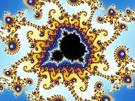
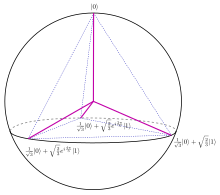
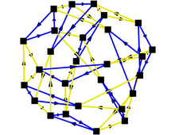

<!-- This is the markdown template for the final project of the Building AI course, 
created by Reaktor Innovations and University of Helsinki. 
Copy the template, paste it to your GitHub README and edit! -->

# UAIMA - Unsolved AI Math Assistant

## Summary

Assist researchers by analyzing ('understanding') previously solved mathematical problems (theorems) in solving yet unsolved problems. The output consists of (steps of) known solved problems that could/should be useful (with a certain amount of probability) in solving your chosen unsolved one.

## Background

Take a look at https://en.wikipedia.org/wiki/List_of_unsolved_problems_in_mathematics. Wouldn't it be nice for YOU to solve one (or more!) still open problems and thus become one of the great mathematical geniuses. For example, see _this_ taken from this Wikipedia page (at February 3, 2025: maybe it is solved in the meantime :smirk:)
* The 8th of Hilbert's problems (23 challenges in total proposed in 1900): _The Riemann hypothesis ("the real part of any non-trivial zero of the Riemann zeta function is 1/2") and other prime-number problems, among them Goldbach's conjecture and the twin prime conjecture_

## How is it used?

Well... to be honest... I am unsure yet. But a lot of care must be put into creating the data (training) set. How to classify (steps of) known solved mathematical problems? 
* By field?
  * algebra
  * number theory
  * geometry
  * calculus
  * probability
  * ...
* By symbols?
  * $$\left( \sum_{k=1}^n a_k b_k \right)^2 \leq \left( \sum_{k=1}^n a_k^2 \right) \left( \sum_{k=1}^n b_k^2 \right)$$
  * $\sqrt{A \bigcap (B \bigcup C)}$
  * $\frac{n!}{k!(n-k)!}$
  * $\sin ^{\cos{y^2}}$
  * ...

Please feel free to submit your own ideas of classification... the more the merrier!

## How to proceed...
As mentioned before... I have actually no idea (yet) how to proceed. Or if this is even possible. But hey, that's also up to you and your contributing ideas :smile: 
Also, this is part of my course at https://buildingai.elementsofai.com/Conclusion/your-ai-idea, and I think it is out of the box enough!

   

###### _Images 'borrowed' from the aformentioned wikipedia page_

